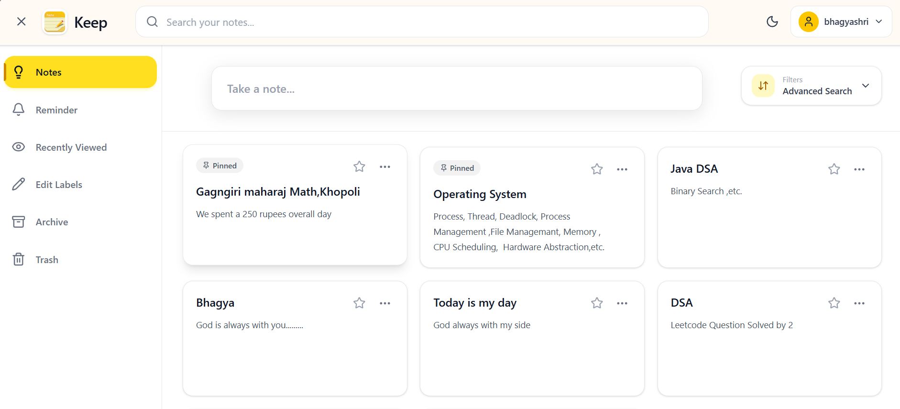
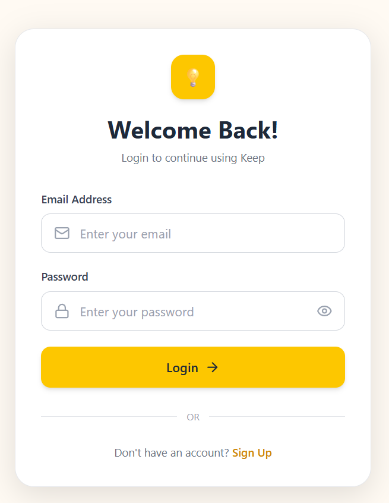
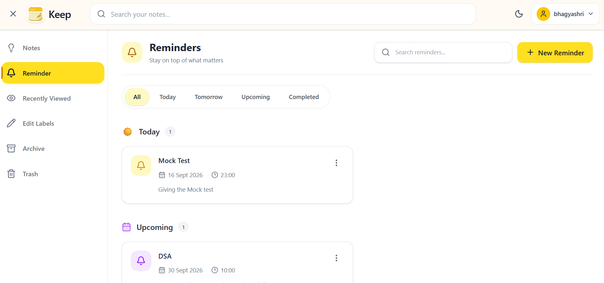
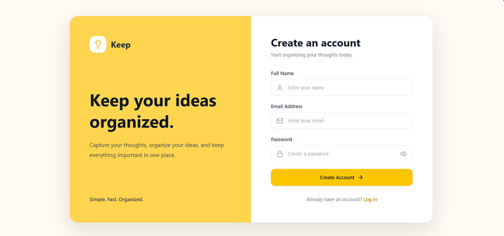
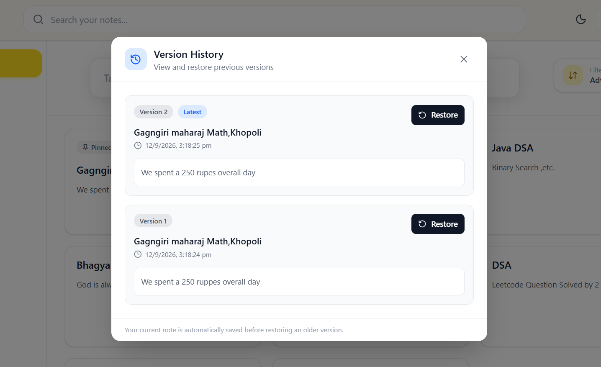

# 📝 Notes-App

A full-stack MERN note management platform designed to help users create, organize, search, and manage notes efficiently.

## ✨ About the Project

Notes-App is a full-stack MERN application built to provide a simple and organized way to manage personal notes.

The application includes authentication, advanced search and filtering, reminders, labels, favorites, archiving, trash management, note sharing, recently viewed notes, auto-save, and version history.

The project focuses on building a practical full-stack application with a clean user interface and real-world functionality.

## 💡 Project Highlights

- Secure user authentication using JWT
- RESTful backend APIs with Express.js
- MongoDB-based data management using Mongoose
- Advanced search, filtering, and sorting
- Real-time note organization with labels, favorites, archive, and trash
- Browser-based reminder notifications
- Automatic saving while editing notes
- Note sharing through shareable links
- Version history to track previous note content
- Responsive interface with dark and light themes

## 🚀 Features

- 🔐 User Authentication with JWT
- 📝 Create, edit, and view notes
- 🔎 Search notes with advanced filters
- 📌 Pin and unpin notes
- ⭐ Favorite notes
- 🏷️ Labels for note organization
- 🎨 Multiple note colors
- ⏰ Reminders with browser notifications
- 📦 Archive and unarchive notes
- 🗑️ Trash, restore, and permanently delete notes
- 👀 Recently viewed notes
- 💾 Auto-save while editing
- 🌙 Dark and light mode
- 🔗 Share notes using shareable links
- 🕒 Version history for edited notes
- 🔑 Change password functionality
- 📱 Responsive and modern user interface

## 🛠️ Tech Stack

### Frontend

- React.js
- Vite
- Tailwind CSS
- JavaScript
- Lucide React

### Backend

- Node.js
- Express.js
- MongoDB
- Mongoose
- JWT Authentication
- bcrypt

### Tools

- Git
- GitHub
- MongoDB Compass

## 📸 Screenshots

### 🏠 Home / Notes Dashboard



### 🔐 Login



### ⏰ Reminders



### 📝 Sign Up



### 🕒 Version History



## 📂 Project Structure

```text
Notes-App/
│
├── BACKEND/
│   ├── models/
│   ├── routes/
│   ├── middleware/
│   └── server.js
│
├── FRONTEND/
│   ├── src/
│   │   ├── Components/
│   │   ├── Pages/
│   │   └── hooks/
│   └── ...
│
├── Screenshot/
│   ├── Homepage.png
│   ├── Login.png
│   ├── Reminder.png
│   ├── SignUp.png
│   └── VersionHistory.png
│
└── README.md


⚙️ Getting Started

Follow these steps to run the project locally.

1. Clone the Repository

git clone https://github.com/khyadebhagyashri56-code/Notes-App.git
cd Notes-App

2. Install Backend Dependencies

cd BACKEND
npm install

3. Configure Environment Variables

Create a .env file inside the BACKEND folder.

MONGO_URI=your_mongodb_connection_string
JWT_SECRET=your_jwt_secret
PORT=5000

Keep your actual .env file private. Do not upload it to GitHub.

4. Start the Backend

npm start

5. Install Frontend Dependencies

Open a new terminal and run:

cd FRONTEND
npm install

6. Start the Frontend

npm run dev

The application will then be available through the local Vite development server.

🔐 Authentication

The application uses JWT-based authentication for user login and protected note operations.

Users can create an account and log in securely.

Passwords are hashed using bcrypt before being stored.

JWT tokens are used to authenticate protected API requests.

User-specific notes are associated with the authenticated user.

🎯 What This Project Demonstrates

This project demonstrates practical experience in:

Full-stack web development

React frontend development

REST API development

Authentication and authorization

MongoDB database integration

CRUD operations

Search, filtering, and sorting

State management and reusable React components

Browser notifications

Git and GitHub workflow

👩‍💻 Author

Bhagyashri Khyade

B.E. Information Technology

Interested in:

Frontend Development

Java Backend Development

Full-Stack Development
